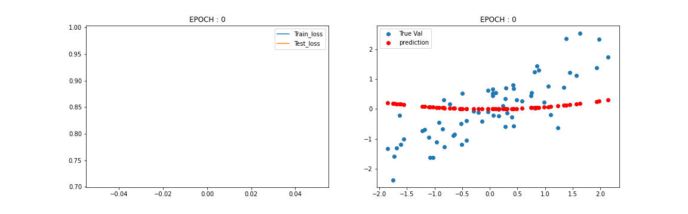
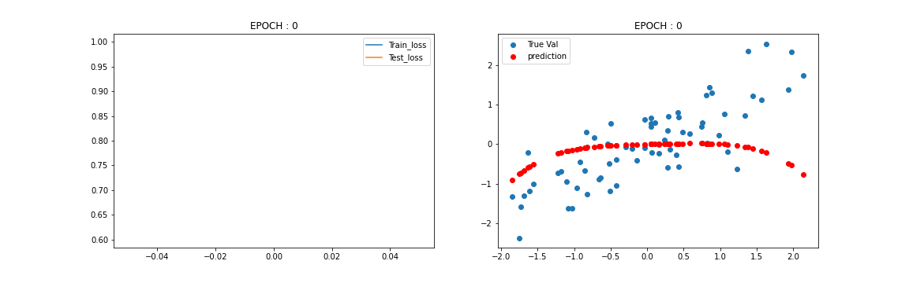
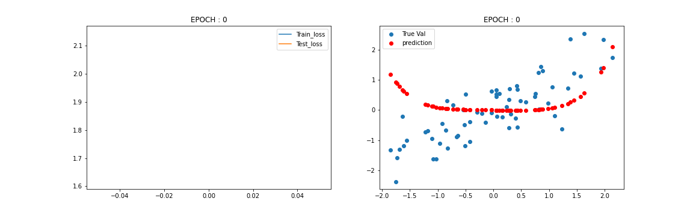
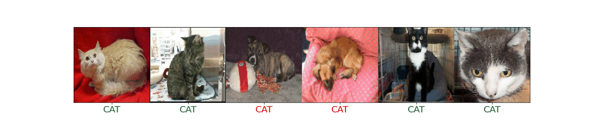
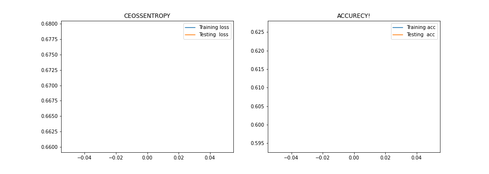

# Practice of Adv Tensorflow

* Regression (Data Source : Youtube Channel)
  #### Model Summary :
  
  * Linear Model( f(x) = W x X + B )
  <p align="center">
    
  </p>
  
  * Polynomial model (deg - 2)
  <p align="center">
    
  </p>
  
  * Polynomial model (deg - 4)
  <p align="center">
    
  </p>
  
  * Polynomial model (deg - 6)
  <p align="center">
    
  </p>
* Cat & Dog Classification

  * *Prediction :*
  <p align="center">
    
  </p>
  
  * *Model Accurecy and loss on training and testing data*
  <p align="center">
    
  </p>
  
  
* handwriting_detect
  
  ***
  
  ##### Model details

  ```python

  def get_base_model():
      #input = tf.keras.layers.Input(shape = (28,28,1))
      #x = tf.keras.layers.Dense(64 , activation=tf.nn.relu)(input)
      #x = tf.keras.layers.MaxPool2D((2,2))(x)
      #x = tf.keras.layers.Dense(128 , activation=tf.nn.relu)(x)
      #x = tf.keras.layers.MaxPool2D((2,2))(x)

      #x = tf.keras.layers.Flatten()(x)
      #x = tf.keras.layers.Dense(256 , activation=tf.nn.relu)(x)
      #x = tf.keras.layers.Dense(26 , activation=tf.nn.sigmoid)(x)

      #model = tf.keras.Model(inputs = input ,outputs = x)
      #model.compile(optimizer = tf.keras.optimizers.RMSprop(learning_rate=0.0001) ,
                    #loss = tf.keras.losses.categorical_crossentropy , metrics = ['acc'])
      #return model

      cls = Sequential()
      cls.add(Conv2D(32, (5, 5), input_shape=(28, 28, 1), activation='relu'))
      cls.add(MaxPooling2D(pool_size=(2, 2)))
      cls.add(Dropout(0.3))
      cls.add(Flatten())
      cls.add(Dense(128, activation='relu'))
      cls.add(Dense(26, activation='softmax'))

      cls.compile(loss='categorical_crossentropy', optimizer='adam', metrics=['accuracy'])
      return cls
  ```

  ##### Conver keras model into tensorflow.js model

  ```python
  !pip install tensorflowjs
  import tensorflowjs as tfjs
  tfjs.converters.save_keras_model(model1 , 'model')
  ```


  ##### UI of the web APP
  ***
  <p align="center">
    
  </p>

  ***

  <p align="center">
    
  </p>
